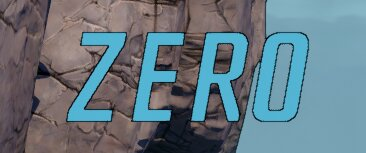

TextMesh MI Coloration
======================

This page is an index of the available MaterialInterface/MaterialInstance objects used
to [color title card text](README-textmesh.md#colors) when major NPCs/Bosses are
introduced in the game.  (I'm honestly not sure why it's sometimes "Interface" and
sometimes "Instance.")  You could probably try applying any MI in the game to these
characters, but these are the ones which we know will work fine with the letters and
look good.

Note that DLC3 mostly just uses prerendered intro cards, so we've hardly got any MI objects
from there at all.  (Or, alas, access to the font they used.)

* [Base Game](#base-game)
* [DLC1 (Moxxi's Heist of the Handsome Jackpot)](#dlc1-moxxis-heist-of-the-handsome-jackpot)
* [DLC2 (Guns, Love, and Tentacles)](#dlc2-guns-love-and-tentacles)
* [DLC3 (Bounty of Blood)](#dlc3-bounty-of-blood)
* [DLC4 (Psycho Krieg and the Fantastic Fustercluck](#dlc4-psycho-krieg-and-the-fantastic-fustercluck)

Base Game
---------

`/Game/Cinematics/Props/Characters_TitleCard/Model/Materials/MI_Cinematics_Agonizer9000Name`

`/Game/Cinematics/Props/Characters_TitleCard/Model/Materials/MI_Cinematics_AgonizerName`

`/Game/Cinematics/Props/Characters_TitleCard/Model/Materials/MI_Cinematics_AgonizerSubtext`

`/Game/Cinematics/Props/Characters_TitleCard/Model/Materials/MI_Cinematics_AnointedName`

`/Game/Cinematics/Props/Characters_TitleCard/Model/Materials/MI_Cinematics_AureliaName`

`/Game/Cinematics/Props/Characters_TitleCard/Model/Materials/MI_Cinematics_AureliaSubName`

`/Game/Cinematics/Props/Characters_TitleCard/Model/Materials/MI_Cinematics_AvaName`

`/Game/Cinematics/Props/Characters_TitleCard/Model/Materials/MI_Cinematics_AvaSubName`

`/Game/Cinematics/Props/Characters_TitleCard/Model/Materials/MI_Cinematics_BlackName`

`/Game/Cinematics/Props/Characters_TitleCard/Model/Materials/MI_Cinematics_BrickName`

`/Game/Cinematics/Props/Characters_TitleCard/Model/Materials/MI_Cinematics_CaptainTrauntName`

`/Game/Cinematics/Props/Characters_TitleCard/Model/Materials/MI_Cinematics_CarnivoraName`

`/Game/Cinematics/Props/Characters_TitleCard/Model/Materials/MI_Cinematics_Character` - This
is the default used when no custom MI is specified.

`/Game/Cinematics/Props/Characters_TitleCard/Model/Materials/MI_Cinematics_Character_Letters_Opaque`

`/Game/Cinematics/Props/Characters_TitleCard/Model/Materials/MI_Cinematics_CityBoss`

`/Game/Cinematics/Props/Characters_TitleCard/Model/Materials/MI_Cinematics_ClayName`

`/Game/Cinematics/Props/Characters_TitleCard/Model/Materials/MI_Cinematics_DropShadow`

`/Game/Cinematics/Props/Characters_TitleCard/Model/Materials/MI_Cinematics_EdenBossName`

`/Game/Cinematics/Props/Characters_TitleCard/Model/Materials/MI_Cinematics_EllieName1`

`/Game/Cinematics/Props/Characters_TitleCard/Model/Materials/MI_Cinematics_GigamindMain`

`/Game/Cinematics/Props/Characters_TitleCard/Model/Materials/MI_Cinematics_GigamindSubtext`

`/Game/Cinematics/Props/Characters_TitleCard/Model/Materials/MI_Cinematics_HammerlockSubName`

`/Game/Cinematics/Props/Characters_TitleCard/Model/Materials/MI_Cinematics_KatagawaJrName`

`/Game/Cinematics/Props/Characters_TitleCard/Model/Materials/MI_Cinematics_KatagawaName`

`/Game/Cinematics/Props/Characters_TitleCard/Model/Materials/MI_Cinematics_LilithName`

`/Game/Cinematics/Props/Characters_TitleCard/Model/Materials/MI_Cinematics_LilithNameWhite`

`/Game/Cinematics/Props/Characters_TitleCard/Model/Materials/MI_Cinematics_LoreleiName`

`/Game/Cinematics/Props/Characters_TitleCard/Model/Materials/MI_Cinematics_Mordecai`

`/Game/Cinematics/Props/Characters_TitleCard/Model/Materials/MI_Cinematics_MordecaiSubName`

`/Game/Cinematics/Props/Characters_TitleCard/Model/Materials/MI_Cinematics_MoxxiName`

`/Game/Cinematics/Props/Characters_TitleCard/Model/Materials/MI_Cinematics_PainName`

`/Game/Cinematics/Props/Characters_TitleCard/Model/Materials/MI_Cinematics_Promethea`

`/Game/Cinematics/Props/Characters_TitleCard/Model/Materials/MI_Cinematics_Rampagername`

`/Game/Cinematics/Props/Characters_TitleCard/Model/Materials/MI_Cinematics_RnR_Amara`

`/Game/Cinematics/Props/Characters_TitleCard/Model/Materials/MI_Cinematics_RnR_Amara_Sub`

`/Game/Cinematics/Props/Characters_TitleCard/Model/Materials/MI_Cinematics_RnR_Green`

`/Game/Cinematics/Props/Characters_TitleCard/Model/Materials/MI_Cinematics_RnR_Moze`

`/Game/Cinematics/Props/Characters_TitleCard/Model/Materials/MI_Cinematics_RnR_White`

`/Game/Cinematics/Props/Characters_TitleCard/Model/Materials/MI_Cinematics_RnR_Yellow`

`/Game/Cinematics/Props/Characters_TitleCard/Model/Materials/MI_Cinematics_RnR_Zane`

`/Game/Cinematics/Props/Characters_TitleCard/Model/Materials/MI_Cinematics_RnR_ZaneSub`

`/Game/Cinematics/Props/Characters_TitleCard/Model/Materials/MI_Cinematics_RyhsName`

`/Game/Cinematics/Props/Characters_TitleCard/Model/Materials/MI_Cinematics_SacrificeName`

`/Game/Cinematics/Props/Characters_TitleCard/Model/Materials/MI_Cinematics_ScraificeGreenName`

`/Game/Cinematics/Props/Characters_TitleCard/Model/Materials/MI_Cinematics_ScraificeYellowName`

`/Game/Cinematics/Props/Characters_TitleCard/Model/Materials/MI_Cinematics_ShivName`

`/Game/Cinematics/Props/Characters_TitleCard/Model/Materials/MI_Cinematics_TannisSubName`

`/Game/Cinematics/Props/Characters_TitleCard/Model/Materials/MI_Cinematics_TerrorName`

`/Game/Cinematics/Props/Characters_TitleCard/Model/Materials/MI_Cinematics_TinaName`

`/Game/Cinematics/Props/Characters_TitleCard/Model/Materials/MI_Cinematics_TroyName`

`/Game/Cinematics/Props/Characters_TitleCard/Model/Materials/MI_Cinematics_Typhon`

`/Game/Cinematics/Props/Characters_TitleCard/Model/Materials/MI_Cinematics_TyreenName`

`/Game/Cinematics/Props/Characters_TitleCard/Model/Materials/MI_Cinematics_Vaughn`

`/Game/Cinematics/Props/Characters_TitleCard/Model/Materials/MI_Cinematics_WainwrightName`

`/Game/Cinematics/Props/Characters_TitleCard/Model/Materials/MI_Cinematics_WardenName`

`/Game/Cinematics/Props/Characters_TitleCard/Model/Materials/MI_Cinematics_WhiteName`

`/Game/Cinematics/Props/Characters_TitleCard/Model/Materials/MI_Cinematics_Zero`

DLC1 (Moxxi's Heist of the Handsome Jackpot)
--------------------------------------------

`/Dandelion/Cinematics/TitleCard/Materials/MI_Cinematics_BlackName`

`/Dandelion/Cinematics/TitleCard/Materials/MI_Cinematics_Ember`

`/Dandelion/Cinematics/TitleCard/Materials/MI_Cinematics_Fabricator`

`/Dandelion/Cinematics/TitleCard/Materials/MI_Cinematics_Fabricator2`

`/Dandelion/Cinematics/TitleCard/Materials/MI_Cinematics_FeralClapTrap`

`/Dandelion/Cinematics/TitleCard/Materials/MI_Cinematics_FeralClapTrap2`

`/Dandelion/Cinematics/TitleCard/Materials/MI_Cinematics_Freddie1`

`/Dandelion/Cinematics/TitleCard/Materials/MI_Cinematics_Freddie2`

`/Dandelion/Cinematics/TitleCard/Materials/MI_Cinematics_Mayor`

`/Dandelion/Cinematics/TitleCard/Materials/MI_Cinematics_Mayor2`

`/Dandelion/Cinematics/TitleCard/Materials/MI_Cinematics_PrettyBoyMech`

`/Dandelion/Cinematics/TitleCard/Materials/MI_Cinematics_PrettyBoyMech2`

`/Dandelion/Cinematics/TitleCard/Materials/MI_Cinematics_TimothyLawrence`

`/Dandelion/Cinematics/TitleCard/Materials/MI_Cinematics_TimothyLawrence2`

`/Dandelion/Cinematics/TitleCard/Materials/MI_Cinematics_WhiteNameOutlined`

DLC2 (Guns, Love, and Tentacles)
--------------------------------

`/Hibiscus/Cinematics/Sequences/SEQ5100_DeathTrapReborn/TitleCard/MI_Cinematics_DeathTrapBlack`

`/Hibiscus/Cinematics/Sequences/SEQ5100_DeathTrapReborn/TitleCard/MI_Cinematics_DeathTrapColor1`

`/Hibiscus/Cinematics/Sequences/SEQ5100_DeathTrapReborn/TitleCard/MI_Cinematics_DeathTrapColor1_2`

`/Hibiscus/Cinematics/Sequences/SEQ4030_Eista/TitleCard/MI_Cinematics_EistaColor1`

`/Hibiscus/Cinematics/Sequences/SEQ4030_Eista/TitleCard/MI_Cinematics_EleanorBlack`

`/Hibiscus/Cinematics/Sequences/SEQ6100_Eleanor/TitleCard/MI_Cinematics_EleanorBlack`

`/Hibiscus/Cinematics/Sequences/SEQ6100_Eleanor/TitleCard/MI_Cinematics_EleanorColor1`

`/Hibiscus/Cinematics/_Desing/Enemies/Frostbiters/MI_CineOnly_Frostbiter_M_Body`

`/Hibiscus/Cinematics/Sequences/SEQ1040_Gaige/TitleCard/MI_Cinematics_GaigeBlack`

`/Hibiscus/Cinematics/Sequences/SEQ1040_Gaige/TitleCard/MI_Cinematics_GaigeColor1`

`/Hibiscus/Cinematics/Sequences/SEQ1070_Mancubus/TitleCard/MI_Cinematics_MancubusBlack`

`/Hibiscus/Cinematics/Sequences/SEQ1070_Mancubus/TitleCard/MI_Cinematics_MancubusColor1`

`/Hibiscus/Cinematics/Sequences/SEQ3200_PosSkrit/TitleCard/MI_Cinematics_PosSkritBlack`

`/Hibiscus/Cinematics/Sequences/SEQ3200_PosSkrit/TitleCard/MI_Cinematics_PosSkritColor1`

`/Hibiscus/Cinematics/Sequences/SEQ4200_Wendigo/TitleCard/MI_Cinematics_WendigoBlack`

`/Hibiscus/Cinematics/Sequences/SEQ4200_Wendigo/TitleCard/MI_Cinematics_WendigoColor1`

DLC3 (Bounty of Blood)
----------------------

`/Geranium/Cinematics/_Design/Sequences/Gehenna_PTC/MI_Cinematics_DropShadow`

`/Geranium/Cinematics/_Design/Sequences/Gehenna_PTC/MI_Cinematics_GERPTC`

DLC4 (Psycho Krieg and the Fantastic Fustercluck)
-------------------------------------------------

`/Alisma/Cinematics/Materials/MI_Cinematics_BlackName`

`/Alisma/Cinematics/Materials/MI_Cinematics_Brick`

`/Alisma/Cinematics/Materials/MI_Cinematics_Brick2`

`/Alisma/Cinematics/Materials/MI_Cinematics_DarkLilith`

`/Alisma/Cinematics/Materials/MI_Cinematics_DarkLilith2`

`/Alisma/Cinematics/Materials/MI_Cinematics_DrBenedict`

`/Alisma/Cinematics/Materials/MI_Cinematics_DrBenedict2`

`/Alisma/Cinematics/Materials/MI_Cinematics_Kreig2`

`/Alisma/Cinematics/Materials/MI_Cinematics_Krieg`

`/Alisma/Cinematics/Materials/MI_Cinematics_Locomobius`

`/Alisma/Cinematics/Materials/MI_Cinematics_Locomobius2`

`/Alisma/Cinematics/Materials/MI_Cinematics_Mordecai`

`/Alisma/Cinematics/Materials/MI_Cinematics_Mordecai2`

`/Alisma/Cinematics/Materials/MI_Cinematics_Psychodin1`

`/Alisma/Cinematics/Materials/MI_Cinematics_Psychodin12`

`/Alisma/Cinematics/Materials/MI_Cinematics_Psychodin2`

`/Alisma/Cinematics/Materials/MI_Cinematics_Psychodin22`

