StaticMesh Text Blocks
======================

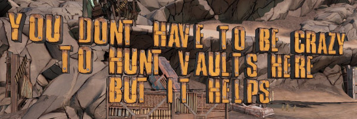

* [Overview](#overview)
* [Basic Usage](#basic-usage)
* [Available Fonts](#available-fonts)
* [Rotations](#rotations)
* [Alignment](#alignment)
* [Scaling](#scaling)
* [Colors](#colors)
  * [API Method](#api-method)
  * [Manual Method](#manual-method)
  * [Advanced: Per-Textblock Coloration](#advanced-per-textblock-coloration)
* [Compass](#compass)
* [Point Grid](#point-grid)
* [TODO](#todo)

Overview
--------

The game data includes two sets of StaticMesh letters, which can be used as
"fonts" to write out text blocks in the game world.  This would be incredibly
cumbersome to do by hand, even with the `mesh_hotfix` method, so a separate
library is available to make it much easier.

Basic Usage
-----------

This library lives inside the `bl3hotfixmod` subdir, and works alongside the
main mod-writing helper there.  To use this in your apps, include the
following among your Python module imports:

```python
from bl3hotfixmod.textmesh import TextMesh
```

The most basic usage of the library would be adding a single line of
text into the map:

```python
TextMesh.inject_text(mod,
        '/Game/Maps/Zone_0/Prologue/Prologue_P',
        (48725, 27789, -3421),
        'this is a line of text',
        )
```

The first argument is an active `Mod` object, which you've already
started earlier in your mod-generation script.  The next argument is
the full path to the map name.  So far, I've only actually used the
`*_P` mapnames; there's probably no reason to ever bother with the
other map paths like `*_Dynamic` or `*_Combat`.  The next argument
is the position in the map.  The easiest way to figure out coordinates
in BL3 is [apple1417's BL3TP project](https://github.com/apple1417/BL3TP/releases),
which will give you a window which shows your current ingame position
at all times.

The final required argument is the actual text to inject into the
map.  This can be just a single string (as you see above), or it
can be a list of strings, to create a text block.  For instance:

```python
TextMesh.inject_text(mod,
        '/Game/Maps/Zone_0/Prologue/Prologue_P',
        (48725, 27789, -3421),
        [
            'you dont have to be crazy',
            'to hunt vaults here',
            'but it helps',
            ],
        )
```

Available Fonts
---------------

There are four "fonts" available in the Borderlands 3 data, though only one
contains the complete set of 26 letters.  First up is `TextMesh.yellowblocks`,
a chunky yellow block text, such as seen on the gateway to Ellie's scrapyard
when you first head to unlock Outrunners in he Droughts.  This font only has
letters, but it's the only one to contain a complete alphabet.  Numbers and
punctuation are not supported.  These meshes *do* have collision information,
so they are climbable and will stop NPC/Player movement.

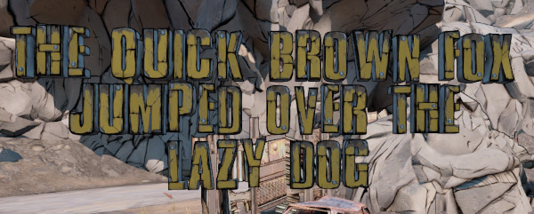

The second is `TextMesh.titlecard`, which is the font used for NPC/Boss
title cards throughout the game.  It's based on the font
[Countach](https://fonts.adobe.com/fonts/countach).  These meshes do
*not* have any collision info, so anything can just walk right through.
This font is missing the letter "Q", but does include some numbers (1,
5, and 8 are missing from those, though).  It also includes some
punctuation: `& ( ) . , !`

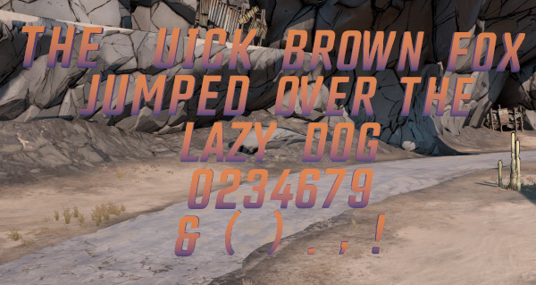

The third font is `TextMesh.titlecard2`, another font used in NPC/Boss
title cards.  This one is based on the font [Posterama](https://www.monotype.com/fonts/posterama).
Its character set is quite limited, though, only containing fourteen
characters (and no digits or punctuation).  The letters included
are: A, B, C, E, G, H, I, L, M, N, R, T, V, and Y.

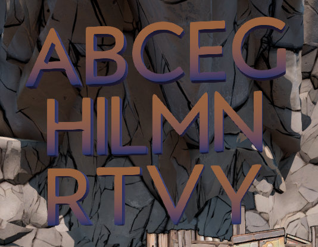

The fourth (and final) font is `TextMesh.zero`, and it's the most
limited of the bunch.  Only the letters Z, E, R, and O are included
here.  Despite the obvious assumption, this does *not* appear to be
the font used in Zer0's intro title card, unless it's been stretched
and altered by the title card processing code.  The "O" does not
contain a slash, for instance, and the characters would have to be
stretched out considerably to get them close to the card.

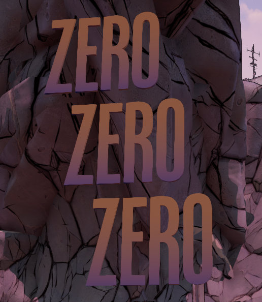

The `yellowblocks` font is the default, and will be used when no font
is specified.  You can specify it explicitly, or use any of the other
fonts, with the `font` parameter:

```python
TextMesh.inject_text(mod,
        '/Game/Maps/Zone_0/Prologue/Prologue_P',
        (48725, 27789, -3421),
        [
            'you dont have to be crazy',
            'to hunt vaults here',
            'but it helps',
            ],
        font=TextMesh.titlecard,
        )
```

Rotations
---------

You'll almost certainly need to rotate the text to get it to show
up how you want, and that's pretty easily done with the `rotation`
parameter.

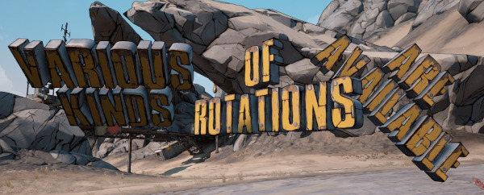

The syntax for that is:

```python
TextMesh.inject_text(mod,
        '/Game/Maps/Zone_0/Prologue/Prologue_P',
        (48725, 27789, -3421),
        'this is a line of text',
        rotation=(0, 0, 0),
        )
```

The value shown there of `(0, 0, 0)` means that the text won't be
rotated at all -- it'll be exactly the same as if you haven't
specified a rotation at all.

 - The first number is "pitch," and will rotate the text around
   the Y axis
 - The second number is "yaw," and will rotate the text around the
   Z axiz
 - The third number is "roll," and will rotate the text around the
   X axis.

The terms pitch, yaw, and roll make sense if you consider the
positive X direction to be "forward."  Visually, the letter StaticMesh
objects do "face" towards that direction.  When you're looking dead-on
at an un-rotated block of text (such as in all the example screenshots
so far), you're facing towards the negative X direction.

The values are specified in degrees, so if you wanted to have your
text face the exact opposite direction that they do by default, you
could use:

```python
TextMesh.inject_text(mod,
        '/Game/Maps/Zone_0/Prologue/Prologue_P',
        (48725, 27789, -3421),
        'this is a line of text',
        rotation=(0, 180, 0),
        )
```

Negative values can also be used for the rotation parameters.  Doubtless
you'll have to just plug some numbers in and see exactly how they work,
with your own text.

Alignment
---------

By default, the text you inject will be centered both horizontally and
vertically.  If you want to change either of those, you can use the
`align` (for horizontal) and/or `valign` (for vertical) parameters.
Here's an example where both are being explicitly set to their default
values:

```python
TextMesh.inject_text(mod,
        '/Game/Maps/Zone_0/Prologue/Prologue_P',
        (48725, 27789, -3421),
        [
            'you dont have to be crazy',
            'to hunt vaults here',
            'but it helps',
            ],
        align=TextMesh.Align.CENTER,
        valign=TextMesh.VAlign.MIDDLE,
        )
```

The valid values for `align` are:

- `TextMesh.Align.CENTER`
- `TextMesh.Align.LEFT`
- `TextMesh.Align.RIGHT`

And the valid values for `valign` are:

- `TextMesh.VAlign.MIDDLE`
- `TextMesh.VAlign.TOP`
- `TextMesh.VAlign.BOTTOM`

The horizontal `align` parameter has the most obvious visual difference,
when injecting a multi-line text block.  It also has an effect on text
rotation, though, too.  By default (with a Center/Middle alignment),
rotations will spin the text around the very center of the text block.
If you specify `align=TextMesh.Align.LEFT`, though, not only will the
text be aligned left, but it'll also rotate around that left side, rather
than the center.

To hopefully more easily visualize this, here's some screenshots of
various horizontal alignments, with a pole showing the point around which
the text will rotate, if you specify a `yaw` value in the `rotation`
parameter:

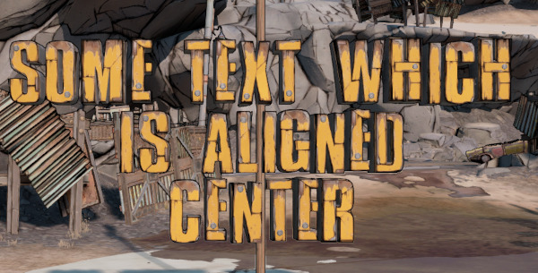

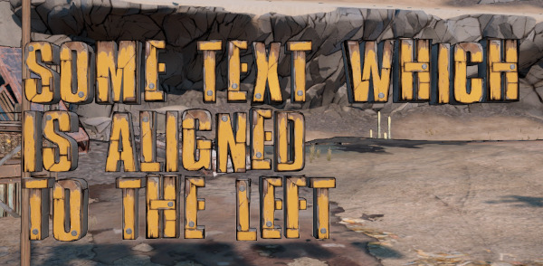

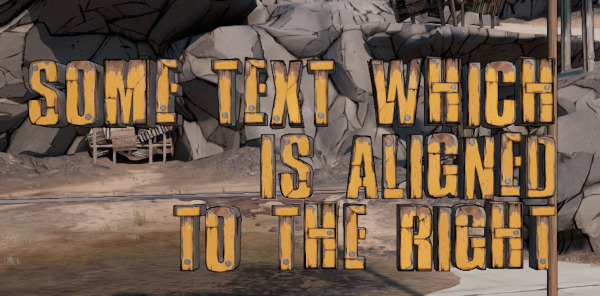

Likewise, here's the various vertical alignments, with a pole showing
the point around which the text will rotate, if you specify a `pitch`
value in the `rotation` parameter:

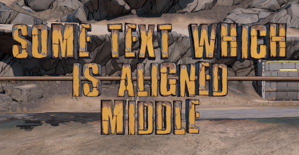

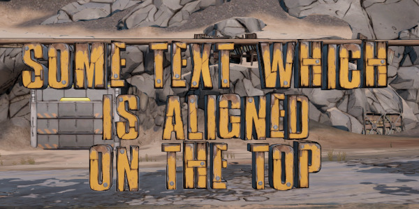

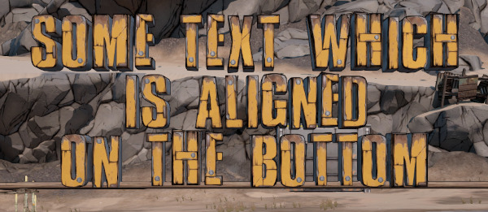

Scaling
-------

These text meshes can also be scaled up or down to suit, using the
`scale` parameter.  This is just a single number at the moment -- `1`
is the default, `0.5` would make the text half-size, and `2` would
make it double size, etc.  You can specify it like so:

```python
TextMesh.inject_text(mod,
        '/Game/Maps/Zone_0/Prologue/Prologue_P',
        (48725, 27789, -3421),
        'this is a line of text',
        scale=2,
        )
```

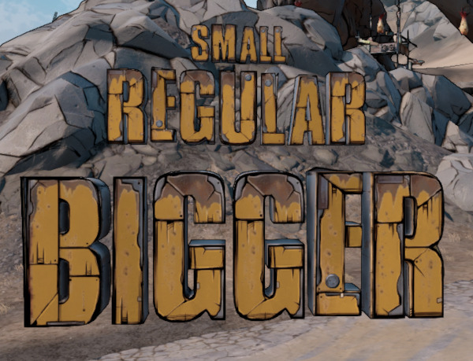

At the moment, there's no way to "stretch" the text along one
specific axis.

Colors
------

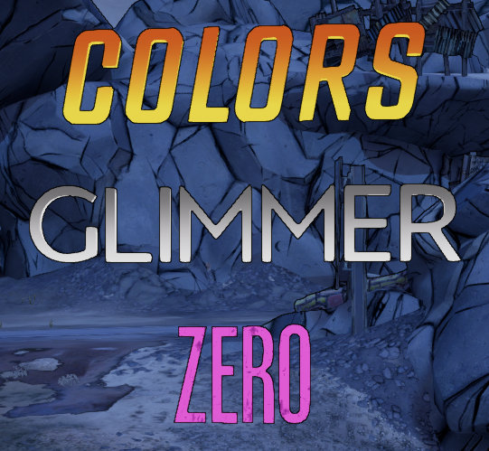

The `titlecard`, `titlecard2`, and `zero` fonts all support custom
colorization, using the various colors that you observe in the title
cards throughout the game.  The method supported directly by this API
can only change coloration per letter on a *level* basis, so if you
specify that the letter "M" on the `titlecard` font should use the
`MI_Cinematics_AgonizerName` coloration on a specific level, then all
hotfix-added instances of letter "M" will be that color.  You won't
be able to have separate text blocks have different colors on the same
level unless they happen to not share any letters in common.  This
method *shouldn't* interfere with any regular NPC/Boss title cards,
though if there's a title card which uses text that *doesn't* explicitly
set its own coloration, it might pick up on your changes instead.

Keep in mind that this will be true even if multiple mods are adding
text to the same map -- whichever mod is executed *last* will determine
the colors used for the letters it's using, within the map.

The available coloration objects (MaterialInterface/MaterialInstance
objects, actually) can be seen in [README-textmesh-colors.md](README-textmesh-colors.md).

### API Method

The method used to set MI coloration on a font, for a particular level
(or for all levels) is `set_level_mi`.  It can be used either on a
Font object as a whole, or on a specific letter.  For instance, to have
all letters in `titlecard` use `MI_Cinematics_AureliaName`, on all levels
that you're touching in your mod:

```python
TextMesh.titlecard.set_level_mi(mod,
    '/Game/Cinematics/Props/Characters_TitleCard/Model/Materials/MI_Cinematics_AureliaName',
    )
```

If you want to have different colors used in different maps, in the same
mod file, you can optionally specify a level as well.  For instance, this
would use `MI_Cinematics_AureliaName` in The Droughts, but
`MI_Cinematics_BrickName` in Ascension Bluff:

```python
TextMesh.titlecard.set_level_mi(mod,
    '/Game/Cinematics/Props/Characters_TitleCard/Model/Materials/MI_Cinematics_AureliaName',
    'Prologue_P',
    )
TextMesh.titlecard.set_level_mi(mod,
    '/Game/Cinematics/Props/Characters_TitleCard/Model/Materials/MI_Cinematics_BrickName',
    'Sacrifice_P',
    )
```

You can also mix-and-match specifying the level.  For instance, this will
use `MI_Cinematics_AureliaName` for The Droughts, but use `MI_Cinematics_BrickName` for
any other level seen in the mod file:

```python
TextMesh.titlecard.set_level_mi(mod,
    '/Game/Cinematics/Props/Characters_TitleCard/Model/Materials/MI_Cinematics_AureliaName',
    'Prologue_P',
    )
TextMesh.titlecard.set_level_mi(mod,
    '/Game/Cinematics/Props/Characters_TitleCard/Model/Materials/MI_Cinematics_BrickName',
    )
```

You can also do the same thing on a per-letter basis, if desired.  Make sure to use the
uppercase letter when specifying this format.  For instance:

```python
TextMesh.titlecard.set_level_mi(mod,
    '/Game/Cinematics/Props/Characters_TitleCard/Model/Materials/MI_Cinematics_AureliaName',
    )
TextMesh.titlecard.letters['E'].set_level_mi(mod,
    '/Game/Cinematics/Props/Characters_TitleCard/Model/Materials/MI_Cinematics_BrickName',
    )
TextMesh.inject_text(mod, '/Game/Maps/Zone_0/Prologue/Prologue_P',
		(48725, 27789, -3421),
		'some text in prologue',
		font=TextMesh.titlecard,
		)
```

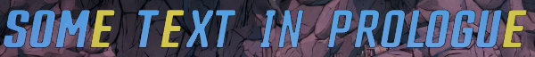

You can use the `set_level_mi` functions at any point in your mod file --
if you've already injected text into a level, it'll output the necessary
hotfixes to colorize all the text that's already been put down.  If you want
to ensure that there aren't any spurious hotfixes injected into your mod
file while setting the color information, though, it's recommended to set
your colors *before* injecting any text into the file.  Still, if you'd
prefer all the coloration hotfixes to be in one spot at the end of the
mod, rather than interleaved with the text injection, feel free to do it
at the end.

### Manual Method

If you prefer to manage font coloration by hand, though, it's quite easy
to do.  Simply set the `StaticMaterials.StaticMaterials[0].MaterialInterface`
attribute on the letter's `StaticMesh` object to the desired MI.  For instance:

```python
mod.reg_hotfix(Mod.LEVEL, 'Prologue_P',
    '/Game/Cinematics/Props/Characters_TitleCard/Model/Meshes/Countach/SM_Cinematic_Letter_Countach_T',
    'StaticMaterials.StaticMaterials[0].MaterialInterface',
    Mod.get_full_cond('/Game/Cinematics/Props/Characters_TitleCard/Model/Materials/MI_Cinematics_TerrorName', 'MaterialInstanceConstant'))
```

### Advanced: Per-Textblock Coloration

**NOTE:** This method isn't really feasible yet, but I wanted to get it
documented regardless.

The coloration methods above operate on a per-level basis, so that all instances
of a given letter within the same level will share the same coloration.
It *is* technically possible to define these on a per-instance basis
instead, so that you could have the same letters use different colors
throughout a map, or even in the same text block.

When we add in new StaticMeshes via hotfixes, new `StaticMeshActor` objects are
added underneath the main `PersistentLevel` map object, with a number suffix on
the end.  Each subsequently-added StaticMesh will end up stored under more objects
like that, with increasing number suffixes.  For instance, the first StaticMesh
added to The Droughts via hotfix will be contained in the object
`/Game/Maps/Zone_0/Prologue/Prologue_P.Prologue_P:PersistentLevel.StaticMeshActor_6`.
The sub-object `.StaticMeshComponent0` from there has an `OverrideMaterials`
array which can be used to set the coloration.

The difficulty here is knowing what those indexes will end up being.  On Athenas,
for instance, the first-added StaticMesh object will have a suffix of `_8`, instead
of The Droughts' `_6`.  Complicating this is that any GBX or other-mod StaticMesh
additions in the map will also end up increasing this number, so a mod on its own
isn't going to know what objects to start altering.

It's certainly possible to do, of course, if you're very sure of the indexes.  The
[coloration example screenshots](README-textmesh-colors.md) were created by figuring
out the "base" Athenas index and keeping track of how many meshes were being added.
The mod line to set a color on a specific placed letter on the map would look like:

```python
mod.reg_hotfix(Mod.LEVEL, 'Monastery_P',
        '/Game/Maps/Zone_1/Monastery/Monastery_P.Monastery_P:PersistentLevel.StaticMeshActor_8.StaticMeshComponent0',
        'OverrideMaterials',
        '({})'.format(
            Mod.get_full_cond('/Game/Cinematics/Props/Characters_TitleCard/Model/Materials/MI_Cinematics_TerrorName', 'MaterialInstanceConstant')),
        )
```

In order to make this a general-purpose solution, though, B3HM would have to have a
mapping of the "base" `StaticMeshActor` index number for every map in the game, keep
track of all hotfix StaticMesh additions in each level, notice when a mod is attempting
to apply color to a specifically-placed StaticMesh, and then fix those indicies as
needed.  Given the complexity of the solution and the relative unimportance of this
"feature," I suspect it'll never be actually supported, but it's at least fun to know
about.

Compass
-------

This is a little bit special-purpose, but this library includes a
helper function to draw a little "compass" in the 3D world, so
that you can have a quick visual reference as to which way the axes
are going, in the area you're working in.  The `inject_compass`
method just has three arguments:

```python
TextMesh.inject_compass(mod,
        '/Game/Maps/Zone_0/Prologue/Prologue_P',
        (47512, 25329, -3830))
```

The first is an active `Mod()` object, the second is the full path
to the map name, and the third is the point at which to draw
the compass.


If you're using a point taken from a character's position while
standing on the ground, the "negative Z" label will end up under
the ground, but most folks probably won't care about that.

Point Grid
----------

This is even more special-purpose, and is probably mostly useless
to boot, given [apple1417's BL3TP project](https://github.com/apple1417/BL3TP/releases),
but this library includes an `inject_point_grid` function to draw
out a set of 3D points within the specified cuboid area in a map.
This might be useful to get an idea of where the coordinates to
various map objects are, or distances between them, though apple1417's
project is probably better for those purposes anyway.  Regardless,
the basic syntax is:

```python
TextMesh.inject_point_grid(mod, '/Game/Maps/Zone_0/Prologue/Prologue_P',
    origin=(46825, 23545, -3831),
    size=(-10000, -10000, 10000),
    increment=1000,
    )
```

The `origin` parameter is the point to start drawing the grid, and the
`size` determines how big of an area to draw.  Note that the `size`
values can be negative.  The `increment` argument specifies how far
apart to draw each point.  `increment` is actually an optional argument
which defaults to the `1000` shown in the example.  That example above
will yield this result:

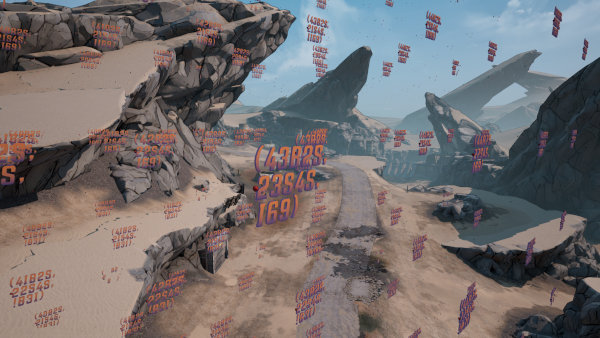

There are a few display limitations with this, namely that we don't
have a font which has a complete set of digits.  The numbers 1, 5, and 8
are represented by `i`, `s`, and `b`, respectively.  Additionally, we
don't have a dash for a negative sign, so negative numbers will be
prefixed with an exclamation mark (`!`) instead.

Other optional arguments to `inject_point_grid` are `label_rotation`,
which should be a rotation tuple which defines how the coordinate labels
are rotated (the default is `(0,45,0)`), and `label_scale`, which
determines the scale to use for the coordinate labels (which defaults
to `1`).

Note that this method ends up generating pretty large modfiles, for
even relatively small grids.  The example above is nearly 7MB, for
instance.

TODO
----

There's a few things which might be good to have in here which
aren't currently supported.

- We could probably press some characters like `i` into service as
  punctuation of various sorts.  It could probably be converted
  into periods, commas, quotation marks, and dahses, given appropriate
  rotations and scaling.
  - Likewise, we could probably combine `o` and `i` on the `titlecard`
    font, to provide a makeshift letter `q`.  It'd be nice to fill in
    the missing digits as well, though I don't know if we'd be able
    to do much better than just using `i`, `s`, and `b`.
- I'd like to add some kind of `wobble` parameter which would
  randomly make various letters look kind of wobbly, somewhat in fitting
  with their general usage in-game.  I'd want to add in some normal
  distribution stuff in here (either via `numpy` or my own implementation),
  a way to optionally control the random seed used, and probably the
  ability to specify it on a per-axis basis.  We'll see if I ever get
  around to that, given all the components.

